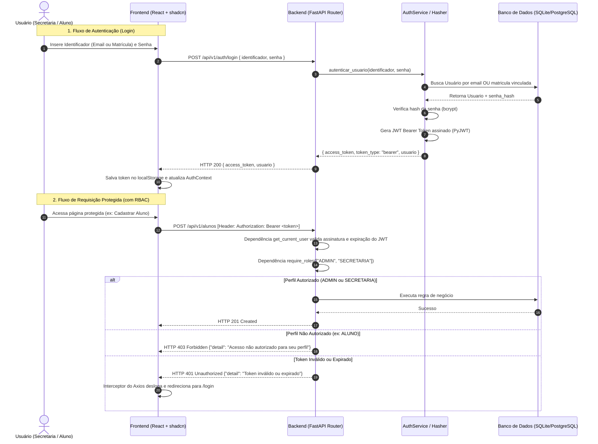

# 🔐 Arquitetura de Autenticação e Controle de Acesso (RBAC)
**Sistema de Gestão Acadêmica - GL4 SGA-EDU**

Este documento detalha a arquitetura técnica, fluxo de dados, contratos de API e implementação do sistema de **Autenticação JWT** e **Controle de Acesso Baseado em Perfis (RBAC)** acordado no alinhamento `/grill-me`.

---

## 1. Visão Geral da Arquitetura

O sistema adota autenticação **Stateless baseada em JSON Web Token (JWT)**, garantindo desacoplamento entre frontend e backend e alta performance sem necessidade de manter sessões em memória no servidor.



---

## 2. Decisões Arquiteturais Definidas (/grill-me)

| Aspecto | Decisão Adotada | Justificativa |
| :--- | :--- | :--- |
| **Padrão de Token** | **JWT Bearer Token (Stateless)** | Facilidade de integração com APIs REST e Swagger, dispensando estado no servidor. |
| **Biblioteca JWT** | **PyJWT (`pyjwt>=2.8.0`)** | Biblioteca padrão da comunidade Python, segura e compatível com as versões mais recentes do Python. |
| **Identificador de Login** | **Flexível (E-mail ou Matrícula)** | Permite que Alunos acessem com sua Matrícula e a Secretaria/Admin acesse com seu E-mail corporativo. |
| **Criptografia de Senha** | **Bcrypt via Passlib (`passlib[bcrypt]`)** | Hash com salt automático e alto fator de custo computacional contra ataques de força bruta. |
| **Controle de Acesso (RBAC)** | **Dependencies no FastAPI (`require_roles`)** | Injeção de dependência declarativa nos endpoints, retornando `HTTP 403 Forbidden` quando o cargo não for permitido. |
| **Seed de Inicialização** | **Criação automática do Admin no Startup** | Garante que o primeiro usuário (`admin@gl4.edu` / `admin123`) exista para o primeiro acesso ao sistema. |
| **Estado no Frontend** | **`AuthContext` + Axios Interceptor** | Centraliza login/logout no React, anexa o cabeçalho Bearer em todas as requisições e redireciona em caso de 401. |

---

## 3. Modelo de Dados e Perfis (Backend)

### 3.1. Enum de Perfis (`PerfilUsuario`)
```python
class PerfilUsuario(str, Enum):
    ADMIN = "ADMIN"           # Acesso irrestrito ao sistema e usuários
    SECRETARIA = "SECRETARIA" # Gestão completa de alunos e matrículas
    PROFESSOR = "PROFESSOR"   # Lançamento de notas e frequências
    ALUNO = "ALUNO"           # Visualização de seus próprios dados
```

### 3.2. Modelo `Usuario` (SQLAlchemy)
```python
class Usuario(Base):
    __tablename__ = "usuarios"

    id = Column(Uuid, primary_key=True, default=uuid.uuid4)
    nome = Column(String(255), nullable=False)  # Ex: "Administrador do Sistema", "Maria (Secretaria)"
    email = Column(String(255), unique=True, nullable=False, index=True)
    senha_hash = Column(String(255), nullable=False)
    perfil = Column(String(50), nullable=False, default=PerfilUsuario.ALUNO.value)
    ativo = Column(Boolean, default=True, nullable=False)
    criado_em = Column(DateTime, default=lambda: datetime.now(timezone.utc), nullable=False)

    # Relacionamento 1:1 com Aluno (caso o usuário seja um aluno)
    aluno = relationship("Aluno", back_populates="usuario", uselist=False)
```

---

## 4. Endpoints da API de Autenticação

### 4.1. `POST /api/v1/auth/login`
Recebe o identificador e a senha para autenticar.

- **Request Body (`LoginRequest`):**
```json
{
  "identificador": "admin@gl4.edu", // ou "202620001" (matrícula)
  "senha": "senhaSegura123"
}
```

- **Response 200 OK (`TokenResponse`):**
```json
{
  "access_token": "eyJhbGciOiJIUzI1NiIsIn...",
  "token_type": "bearer",
  "usuario": {
    "id": "3fa85f64-5717-4562-b3fc-2c963f66afa6",
    "email": "admin@gl4.edu",
    "perfil": "ADMIN",
    "nome": "Administrador do Sistema"
  }
}
```

- **Response 401 Unauthorized:**
```json
{
  "detail": "Credenciais inválidas. Verifique seu login e senha."
}
```

### 4.2. `GET /api/v1/auth/me`
Retorna os dados do usuário atualmente autenticado a partir do token.

- **Headers:** `Authorization: Bearer <token>`
- **Response 200 OK:** Informações do usuário logado.

---

## 5. Proteção de Rotas com RBAC no FastAPI

### 5.1. Dependência `get_current_user`
Valida o token JWT e extrai o ID do usuário do payload:
```python
def get_current_user(
    token: str = Depends(oauth2_scheme),
    db: Session = Depends(get_db)
) -> Usuario:
    payload = decodificar_token(token)
    user_id = payload.get("sub")
    usuario = db.query(Usuario).filter(Usuario.id == user_id, Usuario.ativo == True).first()
    if not usuario:
        raise HTTPException(status_code=401, detail="Usuário inválido ou inativo")
    return usuario
```

### 5.2. Dependência de Autorização `require_roles`
Garante que apenas perfis específicos acessem determinados endpoints:
```python
def require_roles(perfis_permitidos: list[PerfilUsuario]):
    def role_checker(current_user: Usuario = Depends(get_current_user)) -> Usuario:
        if current_user.perfil not in [p.value for p in perfis_permitidos]:
            raise HTTPException(
                status_code=403,
                detail="Acesso não autorizado para o perfil deste usuário."
            )
        return current_user
    return role_checker
```

### Exemplo de uso nas rotas de alunos:
```python
@router.post("/", response_model=AlunoResponse, status_code=status.HTTP_201_CREATED)
def criar_aluno(
    aluno_in: AlunoCreate,
    db: Session = Depends(get_db),
    # Apenas SECRETARIA ou ADMIN podem criar alunos:
    current_user: Usuario = Depends(require_roles([PerfilUsuario.SECRETARIA, PerfilUsuario.ADMIN]))
):
    return aluno_service.criar_aluno(db, aluno_in)
```

---

### 5.3. Consulta administrativa e consulta do próprio Aluno

| Endpoint | Perfis permitidos | Cadastro consultado |
| :--- | :--- | :--- |
| `GET /api/v1/alunos/{aluno_id}` | SECRETARIA, ADMIN | Aluno indicado pelo UUID |
| `GET /api/v1/alunos/me` | ALUNO | Aluno vinculado ao Usuário autenticado |

A consulta `/alunos/me` utiliza `require_roles([PerfilUsuario.ALUNO])` e filtra por `Aluno.usuario_id == current_user.id`. Retorna `AlunoResponse`, sem senha ou hash de senha, e não aceita um ID para escolher outro cadastro. A consulta por UUID exige `require_roles([PerfilUsuario.SECRETARIA, PerfilUsuario.ADMIN])`, inclusive quando o UUID corresponde ao próprio Aluno.

As duas rotas retornam `401` para autenticação inválida ou Usuário inativo e `403` para perfis não permitidos. `/alunos/me` retorna `404` se o Usuário não possuir Aluno vinculado; a consulta administrativa retorna `404` se o UUID não existir. Declare a rota fixa `/me` antes de `/{aluno_id}` para que o roteador não interprete `me` como UUID.

### 5.4. Dashboard institucional

`GET /api/v1/dashboard` declara explicitamente `Depends(require_roles([PerfilUsuario.ADMIN, PerfilUsuario.SECRETARIA]))`. Retorna métricas agregadas da instituição e até quatro cadastros recentes, somente com ID, nome, matrícula, status e criação.

| Perfil / sessão | Resposta |
| :--- | :--- |
| ADMIN ou SECRETARIA autenticados | `200` |
| PROFESSOR ou ALUNO autenticados | `403` |
| Token ausente, inválido ou Usuário inativo | `401` |
| Período diferente de `3`, `6` ou `ano`, com acesso autorizado | `422` |

Na rota `/`, Professor e Aluno visualizam apenas boas-vindas com dados da sessão; o frontend não solicita métricas institucionais para esses perfis. O contrato e as regras dos indicadores estão em `docs/arquitetura_cadastro_alunos.md`, Etapa 5.

---

## 6. Seed do Administrador Inicial (Startup)

Para que o sistema seja utilizável desde a primeira inicialização:
```python
def seed_admin_inicial(db: Session):
    admin = db.query(Usuario).filter(Usuario.email == "admin@gl4.edu").first()
    if not admin:
        novo_admin = Usuario(
            email="admin@gl4.edu",
            senha_hash=gerar_hash_senha("admin123"),
            perfil=PerfilUsuario.ADMIN.value,
            ativo=True
        )
        db.add(novo_admin)
        db.commit()
```

---

## 7. Integração no Frontend (React + shadcn/ui + Feature Slices)

### 7.1. Gerenciamento de Estado (`src/features/auth/context/auth-context.tsx`)
- Mantém o objeto `user` e o `token` em estado global e sincronizado com o `localStorage`.
- Expõe funções `login(identificador, senha)` e `logout()`.
- Acessível através do hook `useAuth()` em `src/features/auth/hooks/use-auth.ts`.

### 7.2. Cliente HTTP e Interceptor (`src/api/client.ts`)
- **Request:** Adiciona `config.headers.Authorization = 'Bearer ' + token` automaticamente se o token existir.
- **Response:** Em caso de `error.response?.status === 401`, remove o token e força redirecionamento para `/login`.

### 7.3. Rota Protegida (`src/features/auth/components/protected-route.tsx`)
```tsx
export function ProtectedRoute({ allowedRoles, children }: ProtectedRouteProps) {
  const { user, isAuthenticated, isLoading } = useAuth();

  if (isLoading) return <Skeleton className="h-32 w-full" />;
  if (!isAuthenticated || !user) return <Navigate to="/login" replace />;
  if (allowedRoles && !allowedRoles.includes(user.perfil)) {
    return <CardAcessoNaoAutorizado perfil={user.perfil} />;
  }

  return children ? <>{children}</> : <Outlet />;
}
```

### 7.4. Tela de Login (`src/features/auth/views/login-view.tsx`)
- Desenvolvida com os componentes shadcn já instalados (`Card`, `Input`, `Field`, `Button`, `Badge`, `Typography`).
- Estilizada com o tema **Meridian** e suporte a modo claro/escuro.
- Re-exportada na Seam pública `src/features/auth/index.ts`.

