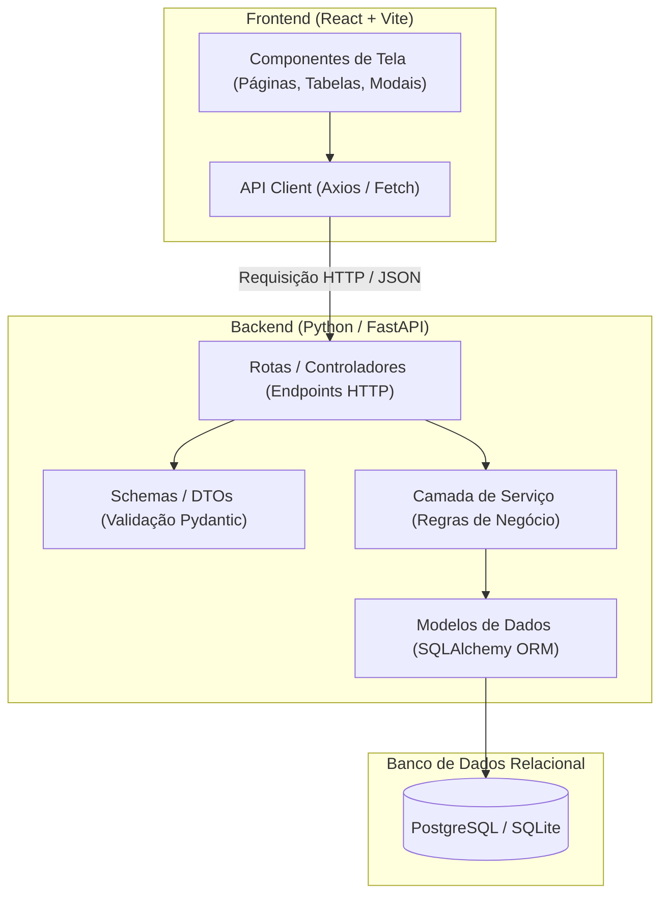
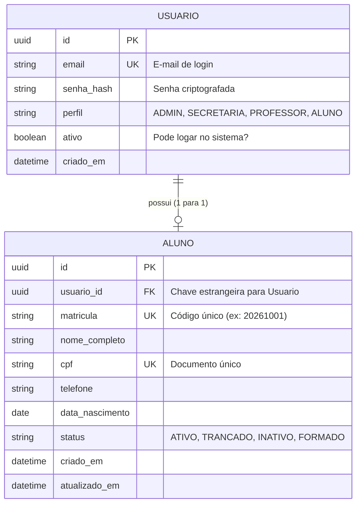
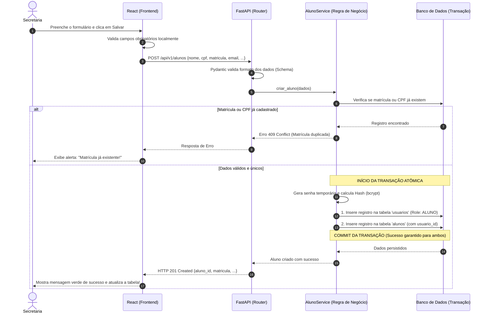

# Guia de Arquitetura e Implementação: Módulo de Cadastro de Alunos

> **Público-alvo:** Desenvolvedores iniciantes e estudantes de engenharia de software full stack.  
> **Projeto:** SGA-Edu (Sistema de Gestão Acadêmica Universitária).  
> **Funcionalidade:** Cadastro e Gestão de Alunos com Controle de Acesso (RBAC).

---

## 1. Introdução: O Que É Uma Aplicação Full Stack?

Antes de escrever qualquer linha de código, é fundamental entender onde cada peça se encaixa. Uma aplicação web moderna é dividida em três pilares principais:

```
[ FRONTEND ]  <==== HTTP / JSON ====>  [ BACKEND ]  <==== SQL ====>  [ BANCO DE DADOS ]
(Interface/React)                     (Regras/FastAPI)                (Persistência/PostgreSQL)
```

### A Analogia do Restaurante 🍽️
Para fixar bem os conceitos:
1. **Frontend (A Fachada / O Garçom):** É tudo o que a pessoa usuária enxerga no navegador (telas, botões, formulários, cores). Ele anota o pedido (dados preenchidos) e entrega para a cozinha.
2. **Backend (A Cozinha / O Chef):** É o servidor que processa as regras de negócio. Ele não se importa com a cor do botão, mas garante: *"Essa pessoa tem permissão para cadastrar?", "Essa matrícula já existe?", "Os dados estão válidos?"*.
3. **Banco de Dados (A Despensa):** É onde as informações ficam guardadas de forma segura e permanente. Mesmo se o servidor for reiniciado, os dados continuam lá.
4. **API (Cardápio / Mensageiro):** É o contrato de comunicação entre o Frontend e o Backend, geralmente no formato **JSON** (um formato de texto leve em formato de chave e valor).

---

## 2. A Tarefa da Sprint e Critérios de Aceite

### User Story (História de Usuário)
> *"Como funcionário da secretaria acadêmica, quero cadastrar alunos no sistema com seus dados de identificação e matrícula, para que constem na base discente e tenham acesso ao portal."*

### Dessecando os Critérios de Aceite:
1. **Formulário com Campos Obrigatórios Sinalizados:** A tela deve ter campos claros (Nome, CPF, E-mail, Data de Nascimento, Matrícula) e indicar visualmente o que é obrigatório (ex: com um asterisco vermelho `*`).
2. **CRUD Completo:**
   - **C**reate (Criar/Cadastrar novo aluno).
   - **R**ead (Listar e buscar alunos por nome ou matrícula).
   - **U**pdate (Editar dados cadastrais de um aluno existente).
   - **D**elete (Neste caso, **Inativação / Soft Delete** — não apagamos o histórico acadêmico do aluno, apenas mudamos seu status para `inativo`).
3. **Criação Automática de Usuário com Perfil RBAC "Aluno":** Ao cadastrar um aluno na secretaria, o sistema deve criar automaticamente as credenciais de login para ele acessar o portal no futuro, atribuindo o papel (Role) de `ALUNO`.
4. **Validação de Matrícula Única:** Duas pessoas não podem ter o mesmo número de matrícula. O sistema deve barrar duplicações tanto no backend quanto no banco de dados.
5. **Testes de Unidade e Integração:** Garantir que o código funcione hoje e continue funcionando mesmo após futuras alterações.

---

## 3. Arquitetura da Solução

### 3.1. Visão Geral da Arquitetura em Camadas

No backend, seguimos uma arquitetura em camadas limpas (Clean Architecture / N-Tier) para não misturar responsabilidades:



---

### 3.2. O Conceito de RBAC (Role-Based Access Control)

**RBAC** significa *Controle de Acesso Baseado em Papéis*. Em uma universidade, diferentes pessoas têm diferentes privilégios:

| Perfil (Role) | O que pode fazer no sistema? |
| :--- | :--- |
| `ADMIN` | Gerencia todo o sistema, configurações e funcionários. |
| `SECRETARIA` | Cadastra alunos, emite históricos, matricula em disciplinas. |
| `PROFESSOR` | Lança notas, faltas e planos de aula. |
| `ALUNO` | Consulta notas, horários, material didático e solicita documentos. |

> [!IMPORTANT]
> **Por que separar `Aluno` de `Usuario`?**  
> `Usuario` representa a identidade de login (e-mail, senha criptografada, perfil de acesso e status de login).  
> `Aluno` representa os dados acadêmicos e civis da pessoa (matrícula, CPF, data de nascimento, telefone).  
> Essa separação permite que, se amanhã o aluno se formar e virar professor, ele continuará sendo a mesma pessoa física com perfis diferentes no sistema!

---

### 3.3. Diagrama de Relacionamento de Dados (ERD)



---

### 3.4. Fluxo Completo do Cadastro (Sequence Diagram)

O diagrama abaixo mostra o que acontece quando a secretária clica em "Salvar Aluno":



> [!TIP]
> **O que é uma Transação Atômica?**  
> Se o sistema conseguir criar o `Usuario`, mas falhar na hora de criar o `Aluno` (por exemplo, queda de rede ou erro de validação), a transação é cancelada (**Rollback**). Assim, nunca teremos um usuário "fantasma" sem aluno vinculado. É o princípio do *"ou salva tudo junto, ou não salva nada"*.

---

## 4. O Backend em Python (FastAPI + SQLAlchemy + Pydantic)

Recomendamos **FastAPI** por ser extremamente rápido, moderno, autodocumentado (gera Swagger em `/docs` automaticamente) e baseado em tipos do Python.

### 4.1. Estrutura de Pastas Sugerida para o Backend

```text
backend/
├── app/
│   ├── main.py                  # Ponto de entrada da aplicação FastAPI
│   ├── core/                    # Configurações globais, segurança, hash de senha
│   │   ├── config.py
│   │   └── security.py
│   ├── database/                # Conexão e sessão com o banco
│   │   └── session.py
│   ├── models/                  # Tabelas do banco (SQLAlchemy)
│   │   ├── usuario.py
│   │   └── aluno.py
│   ├── schemas/                 # Validações de entrada/saída (Pydantic)
│   │   ├── usuario.py
│   │   └── aluno.py
│   ├── services/                # Regras de negócio e transações
│   │   └── aluno_service.py
│   └── api/                     # Rotas HTTP (Endpoints)
│       └── v1/
│           ├── router.py
│           └── endpoints/
│               └── alunos.py
├── tests/                       # Testes automatizados (Pytest)
│   ├── conftest.py
│   ├── test_alunos_service.py
│   └── test_alunos_api.py
├── requirements.txt             # Dependências do projeto
└── README.md
```

---

### 4.2. Modelos de Dados (SQLAlchemy ORM)

Os modelos representam as tabelas físicas no banco de dados.

```python
# app/models/usuario.py
import uuid
from enum import Enum
from sqlalchemy import Column, String, Boolean, DateTime
from sqlalchemy.dialects.postgresql import UUID
from datetime import datetime
from app.database.session import Base

class PerfilUsuario(str, Enum):
    ADMIN = "ADMIN"
    SECRETARIA = "SECRETARIA"
    PROFESSOR = "PROFESSOR"
    ALUNO = "ALUNO"

class Usuario(Base):
    __tablename__ = "usuarios"

    id = Column(UUID(as_uuid=True), primary_key=True, default=uuid.uuid4)
    email = Column(String(255), unique=True, nullable=False, index=True)
    senha_hash = Column(String(255), nullable=False)
    perfil = Column(String(50), nullable=False, default=PerfilUsuario.ALUNO.value)
    ativo = Column(Boolean, default=True, nullable=False)
    criado_em = Column(DateTime, default=datetime.utcnow)
```

```python
# app/models/aluno.py
import uuid
from sqlalchemy import Column, String, Date, ForeignKey, DateTime
from sqlalchemy.dialects.postgresql import UUID
from sqlalchemy.orm import relationship
from datetime import datetime
from app.database.session import Base

class Aluno(Base):
    __tablename__ = "alunos"

    id = Column(UUID(as_uuid=True), primary_key=True, default=uuid.uuid4)
    usuario_id = Column(UUID(as_uuid=True), ForeignKey("usuarios.id"), unique=True, nullable=False)
    matricula = Column(String(20), unique=True, nullable=False, index=True)
    nome_completo = Column(String(200), nullable=False, index=True)
    cpf = Column(String(14), unique=True, nullable=False, index=True)
    telefone = Column(String(20), nullable=True)
    data_nascimento = Column(Date, nullable=False)
    status = Column(String(20), default="ATIVO", nullable=False) # ATIVO, INATIVO
    criado_em = Column(DateTime, default=datetime.utcnow)
    atualizado_em = Column(DateTime, default=datetime.utcnow, onupdate=datetime.utcnow)

    # Relacionamento 1 para 1 com Usuario
    usuario = relationship("Usuario", backref="aluno", uselist=False)
```

---

### 4.3. Schemas de Validação (Pydantic DTOs)

O Pydantic atua como um "filtro de segurança": nenhum dado entra no backend se não estiver no formato esperado.

```python
# app/schemas/aluno.py
from pydantic import BaseModel, EmailStr, Field
from datetime import date, datetime
from uuid import UUID
from typing import Optional

# Dados recebidos do formulário no momento da criação
class AlunoCreate(BaseModel):
    matricula: str = Field(..., min_length=4, max_length=20, description="Matrícula única do aluno")
    nome_completo: str = Field(..., min_length=3, max_length=200)
    cpf: str = Field(..., min_length=11, max_length=14, description="CPF do aluno")
    email: EmailStr = Field(..., description="E-mail que será usado para login")
    telefone: Optional[str] = None
    data_nascimento: date

# Dados permitidos para atualização (edição)
class AlunoUpdate(BaseModel):
    nome_completo: Optional[str] = Field(None, min_length=3, max_length=200)
    telefone: Optional[str] = None
    data_nascimento: Optional[date] = None

# Resposta devolvida para o frontend
class AlunoResponse(BaseModel):
    id: UUID
    usuario_id: UUID
    matricula: str
    nome_completo: str
    cpf: str
    email: EmailStr
    telefone: Optional[str]
    data_nascimento: date
    status: str
    criado_em: datetime

    class Config:
        from_attributes = True
```

---

### 4.4. Camada de Serviço: A Regra de Negócio (Service Layer)

É aqui que mora o "coração" da aplicação.

```python
# app/services/aluno_service.py
from sqlalchemy.orm import Session
from fastapi import HTTPException, status
from app.models.aluno import Aluno
from app.models.usuario import Usuario, PerfilUsuario
from app.schemas.aluno import AlunoCreate, AlunoUpdate
from app.core.security import gerar_hash_senha

class AlunoService:
    def __init__(self, db: Session):
        self.db = db

    def criar_aluno(self, dados: AlunoCreate) -> Aluno:
        # 1. Validar se a matrícula já existe
        if self.db.query(Aluno).filter(Aluno.matricula == dados.matricula).first():
            raise HTTPException(
                status_code=status.HTTP_409_CONFLICT,
                detail=f"A matrícula '{dados.matricula}' já está cadastrada no sistema."
            )

        # 2. Validar se CPF já existe
        if self.db.query(Aluno).filter(Aluno.cpf == dados.cpf).first():
            raise HTTPException(
                status_code=status.HTTP_409_CONFLICT,
                detail="O CPF informado já está cadastrado."
            )

        # 3. Validar se E-mail de usuário já existe
        if self.db.query(Usuario).filter(Usuario.email == dados.email).first():
            raise HTTPException(
                status_code=status.HTTP_409_CONFLICT,
                detail="O e-mail informado já possui uma conta de acesso."
            )

        try:
            # 4. Criação do Usuario (com perfil ALUNO e senha inicial padrão)
            senha_padrao = "Mudar@123" # Em produção, gera um token ou envia email de primeiro acesso
            novo_usuario = Usuario(
                email=dados.email,
                senha_hash=gerar_hash_senha(senha_padrao),
                perfil=PerfilUsuario.ALUNO.value,
                ativo=True
            )
            self.db.add(novo_usuario)
            self.db.flush() # Gera o id do usuario sem fechar a transação

            # 5. Criação do Aluno vinculado ao Usuario
            novo_aluno = Aluno(
                usuario_id=novo_usuario.id,
                matricula=dados.matricula,
                nome_completo=dados.nome_completo,
                cpf=dados.cpf,
                telefone=dados.telefone,
                data_nascimento=dados.data_nascimento,
                status="ATIVO"
            )
            self.db.add(novo_aluno)
            
            # 6. Commit atômico (salva ambos ou cancela tudo em caso de falha)
            self.db.commit()
            self.db.refresh(novo_aluno)
            return novo_aluno

        except Exception as erro:
            self.db.rollback()
            raise HTTPException(
                status_code=status.HTTP_500_INTERNAL_SERVER_ERROR,
                detail=f"Erro interno ao cadastrar aluno: {str(erro)}"
            )

    def listar_alunos(self, busca: Optional[str] = None, apenas_ativos: bool = True):
        query = self.db.query(Aluno)
        if apenas_ativos:
            query = query.filter(Aluno.status == "ATIVO")
        if busca:
            termo = f"%{busca}%"
            query = query.filter(
                (Aluno.nome_completo.ilike(termo)) | (Aluno.matricula.ilike(termo))
            )
        return query.order_by(Aluno.nome_completo).all()

    def inativar_aluno(self, aluno_id: str) -> Aluno:
        aluno = self.db.query(Aluno).filter(Aluno.id == aluno_id).first()
        if not aluno:
            raise HTTPException(status_code=404, detail="Aluno não encontrado.")
        
        # Soft delete: Altera status do Aluno e desativa o login do Usuario
        aluno.status = "INATIVO"
        if aluno.usuario:
            aluno.usuario.ativo = False
            
        self.db.commit()
        self.db.refresh(aluno)
        return aluno
```

---

### 4.5. Endpoints HTTP (FastAPI Routes)

Tabela dos endpoints que serão consumidos pelo Frontend:

| Método | Rota | Descrição | Status Sucesso |
| :--- | :--- | :--- | :--- |
| `POST` | `/api/v1/alunos` | Cadastra novo aluno e gera usuário | `201 Created` |
| `GET` | `/api/v1/alunos` | Lista alunos com filtro de busca | `200 OK` |
| `GET` | `/api/v1/alunos/{id}` | Retorna detalhes do aluno | `200 OK` |
| `PUT` | `/api/v1/alunos/{id}` | Edita dados cadastrais | `200 OK` |
| `PATCH`| `/api/v1/alunos/{id}/inativar` | Inativação lógica (Soft Delete) | `200 OK` |

```python
# app/api/v1/endpoints/alunos.py
from fastapi import APIRouter, Depends, Query, status
from sqlalchemy.orm import Session
from typing import List, Optional
from app.database.session import get_db
from app.schemas.aluno import AlunoCreate, AlunoUpdate, AlunoResponse
from app.services.aluno_service import AlunoService

router = APIRouter(prefix="/alunos", tags=["Alunos"])

@router.post("", response_model=AlunoResponse, status_code=status.HTTP_201_CREATED)
def cadastrar_aluno(dados: AlunoCreate, db: Session = Depends(get_db)):
    service = AlunoService(db)
    return service.criar_aluno(dados)

@router.get("", response_model=List[AlunoResponse])
def listar_alunos(
    busca: Optional[str] = Query(None, description="Busca por nome ou matrícula"),
    apenas_ativos: bool = Query(True, description="Filtrar apenas ativos"),
    db: Session = Depends(get_db)
):
    service = AlunoService(db)
    return service.listar_alunos(busca=busca, apenas_ativos=apenas_ativos)

@router.patch("/{aluno_id}/inativar", response_model=AlunoResponse)
def inativar_aluno(aluno_id: str, db: Session = Depends(get_db)):
    service = AlunoService(db)
    return service.inativar_aluno(aluno_id)
```

---

## 5. O Frontend em React + Vite

O React nos permite criar interfaces reativas e modulares baseadas em componentes.

### 5.1. Estrutura de Pastas Sugerida para o Frontend

```text
frontend/
├── src/
│   ├── assets/              # Imagens, logotipos, ícones
│   ├── components/          # Componentes reutilizáveis
│   │   ├── Navbar.tsx
│   │   ├── CampoTexto.tsx   # Input com label e indicação de obrigatório (*)
│   │   └── ModalConfirmacao.tsx
│   ├── pages/               # Telas da aplicação
│   │   └── Alunos/
│   │       ├── index.tsx                # Tela principal de listagem
│   │       ├── components/
│   │       │   ├── TabelaAlunos.tsx     # Tabela de dados
│   │       │   ├── ModalFormAluno.tsx   # Modal de criar/editar
│   │       │   └── BarraBusca.tsx       # Input de pesquisa
│   ├── services/            # Comunicação com a API
│   │   └── api.ts           # Configuração do Axios
│   │   └── alunosService.ts # Funções que chamam a API
│   ├── types/               # Tipagens TypeScript (interfaces)
│   │   └── aluno.ts
│   ├── App.tsx
│   ├── main.tsx
│   └── index.css
├── package.json
└── vite.config.ts
```

---

### 5.2. Tipagem dos Dados (TypeScript)

Garante que o desenvolvedor não tente acessar uma propriedade que não existe:

```typescript
// src/types/aluno.ts
export interface Aluno {
  id: string;
  usuario_id: string;
  matricula: string;
  nome_completo: string;
  cpf: string;
  email: string;
  telefone?: string;
  data_nascimento: string;
  status: 'ATIVO' | 'INATIVO';
  criado_em: string;
}

export interface NovoAlunoForm {
  matricula: string;
  nome_completo: string;
  cpf: string;
  email: string;
  telefone?: string;
  data_nascimento: string;
}
```

---

### 5.3. Camada de Serviço Frontend (`alunosService.ts`)

```typescript
// src/services/alunosService.ts
import axios from 'axios';
import { Aluno, NovoAlunoForm } from '../types/aluno';

const api = axios.create({
  baseURL: 'http://localhost:8000/api/v1',
});

export const alunosService = {
  async listar(busca?: string): Promise<Aluno[]> {
    const response = await api.get<Aluno[]>('/alunos', {
      params: { busca },
    });
    return response.data;
  },

  async criar(dados: NovoAlunoForm): Promise<Aluno> {
    const response = await api.post<Aluno>('/alunos', dados);
    return response.data;
  },

  async inativar(id: string): Promise<Aluno> {
    const response = await api.patch<Aluno>(`/alunos/${id}/inativar`);
    return response.data;
  }
};
```

---

### 5.4. Exemplo de Componente: Formulário com Validação Visual

Como atender ao critério: *"campos obrigatórios sinalizados e validação de erros"*:

```tsx
// src/pages/Alunos/components/ModalFormAluno.tsx
import React, { useState } from 'react';
import { NovoAlunoForm } from '../../../types/aluno';

interface Props {
  aberto: boolean;
  aoFechar: () => void;
  aoSalvar: (dados: NovoAlunoForm) => Promise<void>;
}

export const ModalFormAluno: React.FC<Props> = ({ aberto, aoFechar, aoSalvar }) => {
  const [form, setForm] = useState<NovoAlunoForm>({
    matricula: '',
    nome_completo: '',
    cpf: '',
    email: '',
    telefone: '',
    data_nascimento: '',
  });

  const [erroApi, setErroApi] = useState<string | null>(null);
  const [salvando, setSalvando] = useState(false);

  if (!aberto) return null;

  const handleChange = (e: React.ChangeEvent<HTMLInputElement>) => {
    setForm({ ...form, [e.target.name]: e.target.value });
  };

  const handleSubmit = async (e: React.FormEvent) => {
    e.preventDefault();
    setErroApi(null);
    setSalvando(true);

    try {
      await aoSalvar(form);
      aoFechar();
    } catch (err: any) {
      // Exibe mensagem de erro devolvida pelo backend (ex: Matrícula duplicada)
      setErroApi(err.response?.data?.detail || 'Erro ao cadastrar aluno.');
    } finally {
      setSalvando(false);
    }
  };

  return (
    <div className="modal-overlay">
      <div className="modal-content">
        <h2>Cadastrar Novo Aluno</h2>
        <p className="legenda">Campos com <span className="obrigatorio">*</span> são obrigatórios.</p>

        {erroApi && <div className="alerta-erro">{erroApi}</div>}

        <form onSubmit={handleSubmit}>
          <div className="campo">
            <label>Matrícula <span className="obrigatorio">*</span></label>
            <input
              type="text"
              name="matricula"
              value={form.matricula}
              onChange={handleChange}
              placeholder="Ex: 20261001"
              required
            />
          </div>

          <div className="campo">
            <label>Nome Completo <span className="obrigatorio">*</span></label>
            <input
              type="text"
              name="nome_completo"
              value={form.nome_completo}
              onChange={handleChange}
              placeholder="Ex: Maria da Silva"
              required
            />
          </div>

          <div className="campo">
            <label>CPF <span className="obrigatorio">*</span></label>
            <input
              type="text"
              name="cpf"
              value={form.cpf}
              onChange={handleChange}
              placeholder="000.000.000-00"
              required
            />
          </div>

          <div className="campo">
            <label>E-mail Institucional <span className="obrigatorio">*</span></label>
            <input
              type="email"
              name="email"
              value={form.email}
              onChange={handleChange}
              placeholder="aluno@universidade.edu.br"
              required
            />
            <small>Este e-mail será usado como login do aluno no portal.</small>
          </div>

          <div className="campo">
            <label>Data de Nascimento <span className="obrigatorio">*</span></label>
            <input
              type="date"
              name="data_nascimento"
              value={form.data_nascimento}
              onChange={handleChange}
              required
            />
          </div>

          <div className="campo">
            <label>Telefone</label>
            <input
              type="text"
              name="telefone"
              value={form.telefone}
              onChange={handleChange}
              placeholder="(11) 98765-4321"
            />
          </div>

          <div className="botoes-acao">
            <button type="button" onClick={aoFechar} disabled={salvando}>Cancelar</button>
            <button type="submit" className="btn-primario" disabled={salvando}>
              {salvando ? 'Cadastrando...' : 'Cadastrar Aluno'}
            </button>
          </div>
        </form>
      </div>
    </div>
  );
};
```

---

## 6. Estratégia de Testes Automatizados

Testes automatizados evitam regressões (quando consertamos uma coisa e quebramos outra sem perceber).

### 6.1. O Que É Teste de Unidade vs. Teste de Integração?
- **Teste de Unidade:** Testa uma função isolada, sem tocar no banco de dados real. Exemplo: *"A função de criptografar senha está gerando um hash válido?"*
- **Teste de Integração:** Testa o fluxo completo (Endpoint + Serviço + Banco de Dados de Teste em memória). Exemplo: *"Quando chamo POST /alunos com matrícula duplicada, o sistema retorna erro 409?"*

### 6.2. Exemplo de Teste de Integração com Pytest

```python
# tests/test_alunos_api.py
import pytest
from fastapi.testclient import TestClient

def test_deve_cadastrar_aluno_e_criar_usuario_automaticamente(client: TestClient):
    # 1. Dados de entrada
    payload = {
        "matricula": "20261001",
        "nome_completo": "Gabriele Natividade",
        "cpf": "123.456.789-00",
        "email": "gabriele@universidade.edu.br",
        "data_nascimento": "2000-05-15",
        "telefone": "11999998888"
    }

    # 2. Executa a requisição
    response = client.post("/api/v1/alunos", json=payload)

    # 3. Asserções (Verificações)
    assert response.status_code == 201
    dados = response.json()
    assert dados["matricula"] == "20261001"
    assert dados["nome_completo"] == "Gabriele Natividade"
    assert dados["status"] == "ATIVO"
    assert "id" in dados
    assert "usuario_id" in dados

def test_deve_falhar_ao_tentar_cadastrar_matricula_duplicada(client: TestClient):
    payload = {
        "matricula": "20261002",
        "nome_completo": "Aluno Teste 1",
        "cpf": "111.222.333-44",
        "email": "aluno1@universidade.edu.br",
        "data_nascimento": "2001-01-01"
    }

    # Primeiro cadastro: deve passar
    res1 = client.post("/api/v1/alunos", json=payload)
    assert res1.status_code == 201

    # Segundo cadastro com a MESMA matrícula: deve falhar com 409 Conflict
    payload_duplicado = payload.copy()
    payload_duplicado["email"] = "outro_email@universidade.edu.br"
    payload_duplicado["cpf"] = "555.666.777-88"

    res2 = client.post("/api/v1/alunos", json=payload_duplicado)
    assert res2.status_code == 409
    assert "já está cadastrada" in res2.json()["detail"]
```

---

## 7. Roteiro Passo a Passo para Implementação

Para orientar os estudos e a construção conjunta, divida o trabalho nos seguintes passos:

### 🚀 Etapa 1: Preparação do Terreno (Ambiente)
- [ ] Criar o ambiente virtual Python no backend (`python -m venv .venv`).
- [ ] Instalar as dependências base: `fastapi`, `uvicorn`, `sqlalchemy`, `pydantic[email]`, `passlib[bcrypt]`, `pytest`.
- [ ] Inicializar o frontend React com Vite: `npm create vite@latest frontend -- --template react-ts`.
- [ ] Instalar `axios` e `lucide-react` (ícones) no frontend.

### 🗄️ Etapa 2: Modelagem e Banco de Dados (Backend)
- [ ] Criar a configuração do SQLAlchemy (`session.py`).
- [ ] Criar o model `Usuario` com campos de login e perfil Enum (`PerfilUsuario`).
- [ ] Criar o model `Aluno` com a chave estrangeira `usuario_id` e restrição `unique=True` em `matricula` e `cpf`.

### 🧠 Etapa 3: Regras de Negócio e Testes (Backend)
- [ ] Criar os Schemas Pydantic (`AlunoCreate`, `AlunoUpdate`, `AlunoResponse`).
- [ ] Escrever o `AlunoService`:
  - Validação de matrícula existente.
  - Criação conjunta de `Usuario` + `Aluno` dentro da mesma transação.
  - Implementação do método `inativar_aluno` (soft delete).
- [ ] Criar os testes unitários e de integração com `pytest` e ver todos passarem no terminal!

### 🌐 Etapa 4: Expondo as Rotas da API (Backend)
- [ ] Criar o router `/api/v1/alunos`.
- [ ] Conectar os endpoints ao `AlunoService`.
- [ ] Abrir o navegador em `http://localhost:8000/docs` (Swagger) e testar a criação de alunos manualmente pela interface interativa.

### 🎨 Etapa 5: Construindo as Telas (Frontend)
- [ ] Configurar o cliente Axios apontando para `http://localhost:8000`.
- [ ] Criar a página de **Listagem de Alunos** com uma tabela bonita e organizada.
- [ ] Adicionar a **Barra de Busca** com filtro por nome e matrícula.
- [ ] Criar o **Modal de Cadastro**:
  - Campos com indicação visual de obrigatório (`*`).
  - Tratamento de erro caso a matrícula já exista (mensagem amigável).
- [ ] Adicionar botão de **Inativar Aluno** com confirmação prévia para evitar cliques acidentais.

---

## 8. Glossário para Fixação dos Conceitos

| Termo | Significado Prático |
| :--- | :--- |
| **CRUD** | As 4 operações básicas de qualquer sistema de cadastro: Create, Read, Update, Delete. |
| **RBAC** | Regra de acesso baseada no cargo da pessoa (ex: Aluno só vê as próprias notas; Secretaria pode cadastrar alunos). |
| **Soft Delete** | Marcar um registro como `inativo` em vez de deletar fisicamente da tabela, preservando histórico. |
| **DTO / Schema** | Objeto que define exatamente quais campos podem entrar e sair da API, blindando o banco. |
| **Hash de Senha** | Transformar a senha em um código irreversível (bcrypt) para nunca guardar senhas em texto puro. |
| **Transação DB** | Pacote de operações que só se concretiza se todas derem certo. Se uma der erro, desfaz tudo (Rollback). |
| **Status HTTP** | Códigos de resposta da internet: `200` (OK), `201` (Criado), `400` (Dado inválido), `404` (Não encontrado), `409` (Conflito/Duplicado), `500` (Erro no servidor). |
